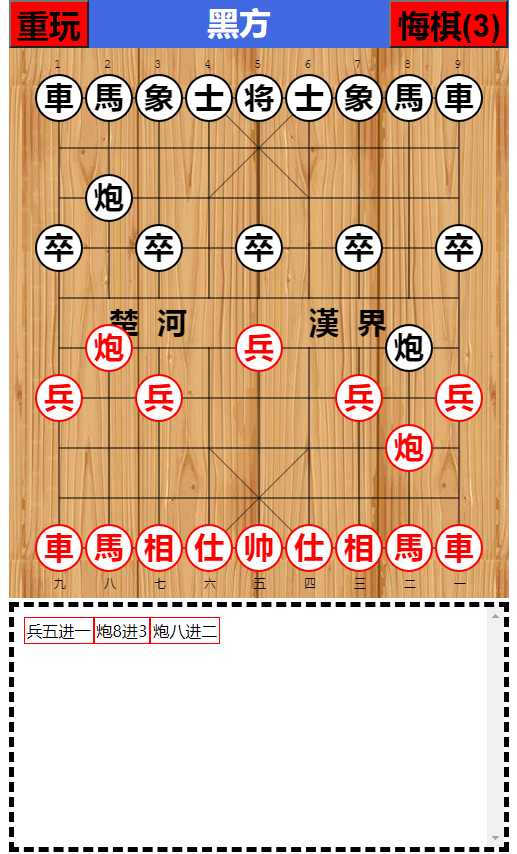

# 前端实现五子棋
# 演示地址
<a href ="https://yanglinyun.github.io/Chinese-chess/">https://yanglinyun.github.io/Chinese-chess/</a>

# 實現效果UI

# 使用技術: HTML5\CSS3\JS
# 第三方库: 无
# 兼容性: chrome\edge\safari\firefox 移动端百分比响应式
# 简介:
1. 使用前端cavas技术绘制 15X15 标志五子棋棋盘、棋子
2. 使用js实现走棋规则 与 吃子规则
# 具体功能:
1. 白先黑后
3. 使用二维数组存储地图,从当前下子的位置向上下左右，左上右上右下左下4个长度检测是否连5子，连则判胜!
4. 记谱功能实现
5. 使用对象深拷贝实现可悔棋5步
6. 重玩
